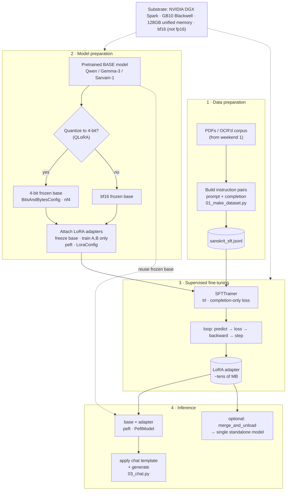
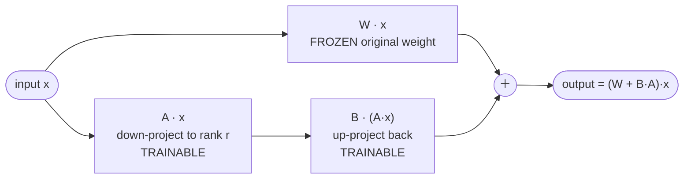

# Fine-Tuning Architecture — Process, Concepts & Tools

A visual map of weekend 2: how raw Sanskrit text becomes a fine-tuned assistant,
and which tool does each job. Diagrams are Mermaid — they render on GitHub,
Obsidian, and most Markdown viewers.

---

## 1 · End-to-end pipeline

---

## 2 · The LoRA concept (why it fits on one machine)

Freeze the giant original weight `W`; train only two skinny matrices `A` and `B`.
Their low-rank product is a small "nudge" added to the frozen weight.

`r` = rank (adapter capacity) · `lora_alpha` = strength scale · only `A`,`B` get
gradients ⇒ **well under 1% of parameters trained**.

---

## 3 · Where SFT sits in the bigger roadmap

---

## Tools used

| Tool | Role in the pipeline |
|------|----------------------|
| **Hugging Face `datasets`** | Loads the `prompt`/`completion` JSONL into a training-ready dataset. |
| **`transformers`** | `AutoModelForCausalLM` / `AutoTokenizer` — loads the pretrained base and its tokenizer; `BitsAndBytesConfig` declares 4-bit. |
| **`bitsandbytes`** | Actually performs the 4-bit (nf4) quantization for QLoRA. Only needed with `--4bit`. |
| **`peft`** | `LoraConfig` defines the adapters; `PeftModel` attaches them at inference; `merge_and_unload()` bakes them in. |
| **`trl`** | `SFTTrainer` + `SFTConfig` — runs supervised fine-tuning with completion-only loss. |
| **`accelerate`** | Device placement and the training-loop plumbing under the Trainer. |
| **`torch`** | The tensor/autograd engine everything sits on (use the DGX Spark container build). |

---

### Legend
`[( … )]` = data/artifact on disk · `{ … }` = decision · dotted arrow = reuse /
runs-on · solid arrow = data or control flow.
